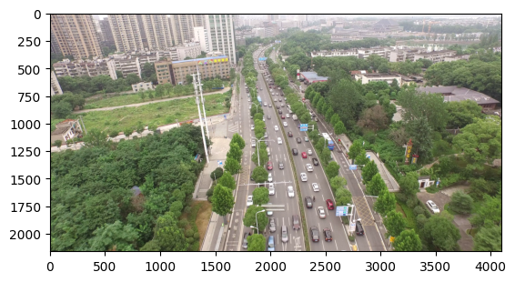
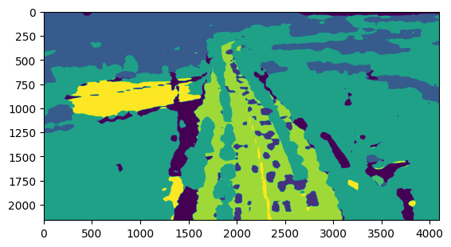
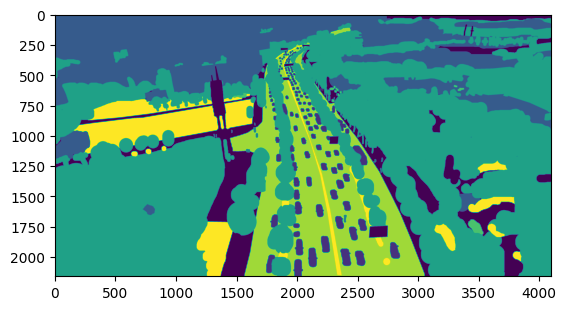

# SegFormer-with-PytorchLightning

This project contains an example of training the SegFormer model for image segmentation using Pytorch Lightning. \
SegFormer is a simple and efficient semantic segmentation architecture which unifies Transformers with lightweight decoders.

In this directory, I include scripts for training a model, a Jupyter notebook example of using the trained model for inference, 
as well as some sample results from the model after 20 epochs of training on [UAVid urban scenes dataset](https://www.kaggle.com/datasets/dasmehdixtr/uavid-v1). \
Project based on 
[NielsRogge SegFormer repo](https://github.com/NielsRogge/Transformers-Tutorials/blob/master/SegFormer)
and [huggingface segformer documentation](https://huggingface.co/docs/transformers/model_doc/segformer).

An example of model results after the first 20 training epochs on a dataset (contains 600 images).

Image:

Prediction:

Mask:

